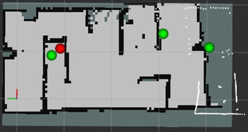

# RADAR
### Risk Aware Detection And Recognition
**Autonomous Reconnaissance Robot for Warzone Scenarios**

> A TurtleBot3 Burger-based autonomous reconnaissance robot that integrates real-time SLAM and YOLO object detection to identify soldiers and tanks in unknown battlefield environments
> automatically marking threat locations on the map.

<br>

<p align="center">
  
</p>

<p align="center">
  
  
  
  
  
</p>

## Contents

- [Project Background](#-project-background)
- [Demo](#-demo)
- [Team](#-team)
- [System Architecture](#-system-architecture)
- [Key Features](#-key-features)
- [AI · Perception](#-ai--perception)
- [Path Algorithm](#-path-algorithm)
- [Qt Tactical HUD](#-qt-tactical-hud)
- [Performance Metrics](#-performance-metrics)
- [Technical Stack](#-technical-stack)
- [Install](#-install)
- [Trouble Shooting](#-trouble-shooting)
- [Plan](#-plan)

---

## 🎯 Project Background
The modern battlefield faces two structural crises.

1. **Rapid Decline in Available Manpower**
The limitations of manned combat have become evident, with tens of thousands of casualties in the Ukraine-Russia war.
South Korea also faces a sharp decline in available manpower due to its low birth rate.

| Year | Available Troops |
|:---:|:---:|
| 2021 | ~290,000 |
| 2040 | ~130,000 (projected) |

This is not merely a numbers problem — it represents a direct national security crisis in the form of a real combat power gap.

2. **Cost Structure of Military Operations**
Maintaining a single human soldier involves significant lifecycle costs, including training, salary, healthcare, welfare, and compensation in the event of death.
Unmanned systems, by contrast, have significantly lower operational and maintenance costs after initial deployment, with no social or financial burden from casualties.


**Conclusion**
RADAR is an unmanned reconnaissance system that combines autonomous navigation and real-time AI detection to effectively monitor battlefield conditions without deploying human soldiers into hazardous environments.
It addresses the manpower shortage while simultaneously improving both the economic efficiency and survivability of military operations.

---

## Demo Video

| # | Description | Link |
|---|------|------|
| 1 | Real-time Autonomous Navigation (1) | [▶ YouTube](https://youtube.com/shorts/bUdc0pBeM_Q) |
| 2 | Real-time Autonomous Navigation (2) | [▶ YouTube](https://youtube.com/shorts/fysW5ICRKj0) |


| Qt HUD Interface | Actual Driving Environment |
|:---:|:---:|
|  |  |
| **SLAM Map Result** | **YOLO Detection Result** |
|  |  |

---

## Team Members

**Affiliation:** Intel 9th Cohort
**Project Period:** 2026.04.13 ~ 2026.04.27

| Role | Name | Responsibilities |
|:---:|:---:|:---|
| **TL** | Yoon Sungjin | SLAM · Real-time Mapping & Autonomous Navigation |
| **DTL / PM** | Bae Hyungyu | AI Perception · YOLO Training · Depth Estimation ML |
| **LE** | An Hyungjun | Overall Development · System Integration · Reactive Algorithm |
| **AE** | Park Sangho | Simulation UI/UX · Qt HUD · Gazebo Simulation |

---

## System Architecture


### Execution Order

```bash
# 1. Pi: Launch robot bringup
bash ~/run_bringup.sh

# 2. Pi: Start YOLO inference
bash ~/run_yolo.sh

# 3. Ubuntu: Start SLAM
bash ~/bin/run_slam.sh

# 4. Ubuntu: Confirm map frame, then start marker node
bash ~/run_marker.sh

# 5. Ubuntu: Start autonomous navigation node
bash ~/run_reactive.sh

# 6. Ubuntu: RViz visualization
bash ~/run_rviz.sh
```

---

## Features

### 1. Real-time SLAM Mapping
- Real-time occupancy grid map generation without a prior map, using LDS-02 LiDAR
- SLAM Toolbox (ROS2 Humble) applied
- Real-time map visualization via RViz2

### 2. YOLO-based Threat Object Detection
- Real-time detection of soldiers (class 0) / tanks (class 1)
- Lightweight YOLO11n model via Knowledge Distillation
- Real-time inference at 5FPS on Raspberry Pi via NCNN conversion

### 3. SLAM-YOLO Fusion for Automatic Threat Map Generation
- Detected objects registered in map coordinate frame via TF2 transform
- ML-based distance estimation using XGBoost for improved marker accuracy
- False positive filtering with 3-confirmation count threshold
- Soldier → green marker / Tank → red marker

### 4. Threat-aware Autonomous Avoidance Patrol
- Automatic U-turn when approaching a confirmed threat within 40cm
- Unvisited area prioritized via Visited Grid Map
- Danger zones automatically blacklisted (penalty=50)

### 5. Qt Tactical HUD Integrated Monitoring
- Unified display: radar scope / YOLO camera / SLAM map / compass / enemy positions
- Teleop (manual control) mode switching supported
- Real-time battery level monitoring


## AI · Perception

### YOLO Training

| Stage | Dataset | Soldier mAP50 | Tank mAP50 | mAP50 |
|:---:|:---:|:---:|:---:|:---:|
| Round 1 (Roboflow, 900 images) | External data | 0.097 | 0.073 | 0.040 |
| Round 2 (Self-collected, 525 images) | Self-captured | 0.835 | 0.895 | 0.865 |
| **KD Applied (YOLO11n KD)** | **Self-captured** | **0.862** | **0.917** | **0.889** |
| YOLO11m (reference) | Self-captured | 0.879 | 0.927 | 0.904 |

#### Collected Data


### Knowledge Distillation

Knowledge Distillation was applied to achieve YOLO11m (20.1M)-level performance
while maintaining the YOLO11n (2.6M) model size.

```
> **Result:** **2.4% mAP improvement** over YOLO11n while maintaining 2.6M parameters
```

### Depth Estimation (XGBoost)

An ML-based distance estimation model was built to address the load and noise issues of depth cameras.

- **Data Collection:** 650 samples combining Depth Camera + TurtleBot + Bounding Box
- **Features (42):** Bounding box coordinates, object size, IMU, aspect ratio, etc.
- **Models Compared:** Random Forest / Linear Regression / **XGBoost** / LightGBM
- **Final Model:** XGBoost (unnecessary features removed via Feature Importance)
- **Test MAE: 3.8cm**

---

## 🗺️ Path Algorithm

### Obstacle Avoidance
1. Detect frontal obstacle → `escaping = True`
2. Compare left/right distance → rotate toward side with more clearance
3. Once front is clear and timeout elapsed → escape complete

### Enemy Detection & U-turn
1. YOLO detection → publish `/detections`
2. `detection_marker_node` confirms after 3 detections → publish `/danger_detected`
3. `reactive_patrol_node` stores threat coordinates
4. U-turn triggered when approaching threat within 40cm
5. Avoidance sequence: `STOP(3s) → ROTATE(5s) → ESCAPE(2s) → FORWARD(1s)`

### Normal Navigation with Coverage Optimization
1. Wall-following navigation based on left/right critical distances
2. Visited Grid Map tracks visited cells
3. At intersections, direction with fewer visits is prioritized
4. Cells near danger zones receive a penalty (50) to suppress re-approach

---

## 🖥️ Qt 전술 HUD


**HUD 기능 목록**

| 기능 | 설명 |
|:---|:---|
| Login | 사용자 인증 및 접근 제어 |
| Radar Scope | LiDAR 기반 실시간 스캔 시각화 |
| Compass | IMU 기반 방향각 실시간 표시 |
| Camera | YOLO bbox 오버레이 실시간 영상 |
| LIDAR Map | SLAM 점유 격자 지도 표시 및 마커 |
| Enemy Info | 탐지 적 수 / 좌표 표시 |
| Battery State | 배터리 잔량 모니터링 |
| Manual Mode | 텔레오프 수동 조작 전환 |

---

## 🖥️ Qt Tactical HUD


**HUD Feature List**

| Feature | Description |
|:---|:---|
| Login | User authentication and access control |
| Radar Scope | Real-time LiDAR scan visualization |
| Compass | Real-time heading angle display via IMU |
| Camera | Live video with YOLO bounding box overlay |
| LIDAR Map | SLAM occupancy grid display with markers |
| Enemy Info | Detected enemy count and coordinates |
| Battery State | Real-time battery level monitoring |
| Manual Mode | Teleop manual control switching |

---

## Performance Metrics

### Map Exploration Performance

| Metric | Best Case | Average | Target |
|:---:|:---:|:---:|:---:|
| Map Coverage Rate | **96.2%** | 73.4% | 75% |
| Avg. Marker Position Error | **10.5cm** | 22.3cm | 20~30cm |
| Missed Detections | **1** | 1.7 | ≤1 |

### YOLO Performance Summary

| Model | Parameters | Soldier mAP50 | Tank mAP50 | mAP50 |
|:---:|:---:|:---:|:---:|:---:|
| YOLO11n | 2.6M | 0.835 | 0.895 | 0.865 |
| YOLO11n KD | 2.6M | 0.862 | 0.917 | **0.889** |
| YOLO11m | 20.1M | 0.879 | 0.927 | 0.904 |

### Depth Estimation
- **Model:** XGBoost
- **Test MAE:** 3.8cm

---
## 🔧 Technical Stack

### System & Dev


### Hardware
| Component | Details |
|:---|:---|
| Robot Platform | TurtleBot3 Burger |
| Onboard Computer | Raspberry Pi 4 |
| Motor Controller | OpenCR |
| LiDAR | LDS-02 (10Hz, ~220 points) |
| Camera | IMX219 PiCamera (640×480) |
| Drive Motor | Dynamixel XL430 |

### Robotics & Navigation

- SLAM Toolbox, RViz2, Nav2, Gazebo

### AI & Perception

- Ultralytics YOLO11, NCNN (lightweight inference), Roboflow (dataset)
- XGBoost (Depth Estimation)

### UI
- Qt5 (Tactical HUD)

---

## 🚀 Install

### Requirements
```
- Ubuntu 22.04
- ROS2 Humble
- Python 3.10
- Raspberry Pi OS (Pi 4)
- ROS_DOMAIN_ID=11
- TURTLEBOT3_MODEL=burger
```

### Install Dependencies

```bash
# ROS2 Humble packages (Ubuntu PC)
sudo apt install ros-humble-slam-toolbox
sudo apt install ros-humble-tf2-geometry-msgs
sudo apt install ros-humble-visualization-msgs

# Python packages
pip install ultralytics joblib pandas xgboost scikit-learn --break-system-packages

# NCNN (install on Pi)
pip install ncnn --break-system-packages
```

### Clone Repository

```bash
git clone https://github.com/[YOUR_REPO]/radar.git
cd radar
```

### Set Script Permissions

```bash
chmod +x ~/run_bringup.sh
chmod +x ~/run_yolo.sh
chmod +x ~/bin/run_slam.sh
chmod +x ~/run_marker.sh
chmod +x ~/run_reactive.sh
chmod +x ~/run_rviz.sh
```

### Run (Order Matters)

```bash
# [Pi Terminal 1] TurtleBot3 bringup
bash ~/run_bringup.sh

# [Pi Terminal 2] YOLO inference node
bash ~/run_yolo.sh

# [Ubuntu Terminal 1] SLAM
bash ~/bin/run_slam.sh

# [Ubuntu Terminal 2] After confirming map frame
bash ~/run_marker.sh

# [Ubuntu Terminal 3] Autonomous navigation
bash ~/run_reactive.sh

# [Ubuntu Terminal 4] RViz visualization
bash ~/run_rviz.sh
```

### Port Setup (Pi — check on every restart)

```bash
sudo chmod 666 /dev/ttyACM*
```

### Save Map

```bash
mkdir -p ~/maps
ros2 run nav2_map_server map_saver_cli -f ~/maps/patrol_map
```

---

## 📁 Project Structure
```
radar/
├── autonomous_driving/
│   ├── reactive_patrol_node.py       # Main autonomous navigation node
│   ├── detection_marker_node.py      # YOLO-SLAM fusion marker node
│   └── ml/
│       ├── xgb_y_model.pkl           # XGBoost depth estimation model
│       └── xgb_feature_y_cols.pkl    # Feature column info
│
├── project/
│   └── yolo_picamera_to_ubuntu_compressed_default.py  # Pi YOLO inference node
│
├── yolo/
│   ├── weights/depth/                # YOLO .pt weights
│   └── ncnn/                         # NCNN converted model
│
├── qt_hud/                           # Qt Tactical HUD source
│
├── run_bringup.sh
├── run_yolo.sh
├── run_marker.sh
├── run_reactive.sh
├── run_rviz.sh
└── bin/
└── run_slam.sh
```

---

## 🔥 Trouble Shooting

### 1. Qt Camera Delay
| | Details |
|:---|:---|
| **Cause** | Network bandwidth exceeded by uncompressed image stream |
| **Issue** | Camera lag affected all other ROS2 nodes |
| **Fix** | Used `CompressedImage` topic (`/yolo_camera/compressed`, JPEG q=55) |

### 2. Navigation Stability
| | Details |
|:---|:---|
| **Cause** | Reactive algorithm insufficient for narrow corridors and corners |
| **Issue** | Wall corner collisions, repeated loop on same path |
| **Fix** | Parameter tuning (100+ test runs), physical bumper added at corners, Visited Grid Map introduced |

### 3. Marker Position Error
| | Details |
|:---|:---|
| **Cause** | Heading error when detecting during robot rotation |
| **Issue** | 20~30° marker position offset |
| **Fix** | Blocked marker generation during rotation via `/robot_turning` topic; dual filtering with IMU + odom |

### 4. TF Transform Failure
| | Details |
|:---|:---|
| **Cause** | Future timestamp error when looking up TF based on image stamp |
| **Issue** | Frequent `TransformException` |
| **Fix** | Added `stamp=0` (latest TF) fallback logic; expanded TF buffer cache to 10 seconds |

---

## 🔭 Plan

### Short-term Goals
- [x] Real-time SLAM implementation
- [x] Qt GUI responsiveness improvement
- [x] Perception model upgrade (Knowledge Distillation)
- [ ] Further Qt GUI UX improvements

### Long-term Goals
- [ ] **Multi-SLAM** — Cooperative mapping with multiple robots
- [ ] **3D Mapping** — Volumetric map using 3D LiDAR
- [ ] **Visual SLAM** — Camera-based SLAM
- [ ] **SDV Performance** — Faster and more stable autonomous navigation

---

<p align="center">
  <strong>RADAR</strong> — Risk Aware Detection And Recognition<br>
  Intel 9th Edge AI Bootcamp | 2026.04
</p>
